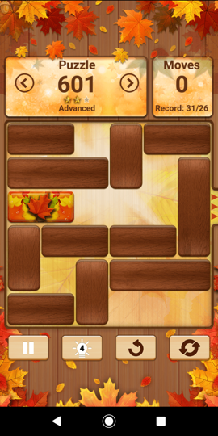

# UNBLOCK

This node program solves `unblock me` types of puzzle :



## PREPARATION

The game must be prepared in a json file. Example `601.json` :
```
{
	"nrow":6,
	"ncol":6,
	"exitrow":2,
	"exitcol":4,	
	"pieces":[
		{"dir":"h","len":2,"row":2,"col":0},
		{"dir":"h","len":2,"row":0,"col":0},	
		{"dir":"v","len":2,"row":0,"col":3},
		{"dir":"h","len":2,"row":0,"col":4},
		{"dir":"h","len":3,"row":1,"col":0},
		{"dir":"v","len":3,"row":1,"col":5},
		{"dir":"v","len":2,"row":3,"col":0},
		{"dir":"h","len":2,"row":3,"col":1},
		{"dir":"h","len":2,"row":3,"col":3},
		{"dir":"v","len":2,"row":4,"col":2},
		{"dir":"h","len":3,"row":4,"col":3},		
		{"dir":"h","len":2,"row":5,"col":0}
	]
}
```

* `nrow` is the number of rows of the field

* `ncol` is the number of colums of the field

* `exitrow` is the row the target must reach

* `exitcol` is the column the target must reach

* `pieces` is the array of pieces

	The first piece MUST BE the target (usually the red piece)

	`dir` specify if the piece is horizontal (h) or vertical (v)
  
	`row` and `col` specify the left-most or top-most position of the piece

## EXECUTION

Run
```
node unblock.js 601.json
```

If everything is OK, the solution is displayed one step after each other.
Example :

```
  1  1  .  2  3  3
  4  4  4  2  .  5
  0  0  .  .  .  5
  6  7  7  8  8  5
  6  .  9 10 10 10
 11 11  9  .  .  .
-------------------------
1 : 0 right
  1  1  .  2  3  3
  4  4  4  2  .  5
  .  0  0  .  .  5
  6  7  7  8  8  5
  6  .  9 10 10 10
 11 11  9  .  .  .
-------------------------
2 : 2 bottom
  1  1  .  .  3  3
  4  4  4  2  .  5
  .  0  0  2  .  5
  6  7  7  8  8  5
  6  .  9 10 10 10
 11 11  9  .  .  .
-------------------------
3 : 3 left
  1  1  .  3  3  .
  4  4  4  2  .  5
  .  0  0  2  .  5
  6  7  7  8  8  5
  6  .  9 10 10 10
 11 11  9  .  .  .
-------------------------
4 : 5 top
  1  1  .  3  3  5
  4  4  4  2  .  5
  .  0  0  2  .  5
  6  7  7  8  8  .
  6  .  9 10 10 10
 11 11  9  .  .  .
-------------------------
5 : 6 top
  1  1  .  3  3  5
  4  4  4  2  .  5
  6  0  0  2  .  5
  6  7  7  8  8  .
  .  .  9 10 10 10
 11 11  9  .  .  .
-------------------------
6 : 8 right
  1  1  .  3  3  5
  4  4  4  2  .  5
  6  0  0  2  .  5
  6  7  7  .  8  8
  .  .  9 10 10 10
 11 11  9  .  .  .
-------------------------
7 : 2 bottom
  1  1  .  3  3  5
  4  4  4  .  .  5
  6  0  0  2  .  5
  6  7  7  2  8  8
  .  .  9 10 10 10
 11 11  9  .  .  .
-------------------------
8 : 4 right
  1  1  .  3  3  5
  .  4  4  4  .  5
  6  0  0  2  .  5
  6  7  7  2  8  8
  .  .  9 10 10 10
 11 11  9  .  .  .
-------------------------
9 : 6 top
  1  1  .  3  3  5
  6  4  4  4  .  5
  6  0  0  2  .  5
  .  7  7  2  8  8
  .  .  9 10 10 10
 11 11  9  .  .  .
-------------------------
10 : 7 left
  1  1  .  3  3  5
  6  4  4  4  .  5
  6  0  0  2  .  5
  7  7  .  2  8  8
  .  .  9 10 10 10
 11 11  9  .  .  .
-------------------------
11 : 9 top
  1  1  .  3  3  5
  6  4  4  4  .  5
  6  0  0  2  .  5
  7  7  9  2  8  8
  .  .  9 10 10 10
 11 11  .  .  .  .
-------------------------
12 : 11 right
  1  1  .  3  3  5
  6  4  4  4  .  5
  6  0  0  2  .  5
  7  7  9  2  8  8
  .  .  9 10 10 10
  . 11 11  .  .  .
-------------------------
13 : 11 right
  1  1  .  3  3  5
  6  4  4  4  .  5
  6  0  0  2  .  5
  7  7  9  2  8  8
  .  .  9 10 10 10
  .  . 11 11  .  .
-------------------------
14 : 11 right
  1  1  .  3  3  5
  6  4  4  4  .  5
  6  0  0  2  .  5
  7  7  9  2  8  8
  .  .  9 10 10 10
  .  .  . 11 11  .
-------------------------
15 : 9 bottom
  1  1  .  3  3  5
  6  4  4  4  .  5
  6  0  0  2  .  5
  7  7  .  2  8  8
  .  .  9 10 10 10
  .  .  9 11 11  .
-------------------------
16 : 7 right
  1  1  .  3  3  5
  6  4  4  4  .  5
  6  0  0  2  .  5
  .  7  7  2  8  8
  .  .  9 10 10 10
  .  .  9 11 11  .
-------------------------
17 : 6 bottom
  1  1  .  3  3  5
  .  4  4  4  .  5
  6  0  0  2  .  5
  6  7  7  2  8  8
  .  .  9 10 10 10
  .  .  9 11 11  .
-------------------------
18 : 4 left
  1  1  .  3  3  5
  4  4  4  .  .  5
  6  0  0  2  .  5
  6  7  7  2  8  8
  .  .  9 10 10 10
  .  .  9 11 11  .
-------------------------
19 : 2 top
  1  1  .  3  3  5
  4  4  4  2  .  5
  6  0  0  2  .  5
  6  7  7  .  8  8
  .  .  9 10 10 10
  .  .  9 11 11  .
-------------------------
20 : 6 bottom
  1  1  .  3  3  5
  4  4  4  2  .  5
  .  0  0  2  .  5
  6  7  7  .  8  8
  6  .  9 10 10 10
  .  .  9 11 11  .
-------------------------
21 : 6 bottom
  1  1  .  3  3  5
  4  4  4  2  .  5
  .  0  0  2  .  5
  .  7  7  .  8  8
  6  .  9 10 10 10
  6  .  9 11 11  .
-------------------------
22 : 7 left
  1  1  .  3  3  5
  4  4  4  2  .  5
  .  0  0  2  .  5
  7  7  .  .  8  8
  6  .  9 10 10 10
  6  .  9 11 11  .
-------------------------
23 : 8 left
  1  1  .  3  3  5
  4  4  4  2  .  5
  .  0  0  2  .  5
  7  7  .  8  8  .
  6  .  9 10 10 10
  6  .  9 11 11  .
-------------------------
24 : 5 bottom
  1  1  .  3  3  .
  4  4  4  2  .  5
  .  0  0  2  .  5
  7  7  .  8  8  5
  6  .  9 10 10 10
  6  .  9 11 11  .
-------------------------
25 : 3 right
  1  1  .  .  3  3
  4  4  4  2  .  5
  .  0  0  2  .  5
  7  7  .  8  8  5
  6  .  9 10 10 10
  6  .  9 11 11  .
-------------------------
26 : 2 top
  1  1  .  2  3  3
  4  4  4  2  .  5
  .  0  0  .  .  5
  7  7  .  8  8  5
  6  .  9 10 10 10
  6  .  9 11 11  .
-------------------------
27 : 0 right
  1  1  .  2  3  3
  4  4  4  2  .  5
  .  .  0  0  .  5
  7  7  .  8  8  5
  6  .  9 10 10 10
  6  .  9 11 11  .
-------------------------
28 : 0 right
  1  1  .  2  3  3
  4  4  4  2  .  5
  .  .  .  0  0  5
  7  7  .  8  8  5
  6  .  9 10 10 10
  6  .  9 11 11  .
-------------------------
29 : 9 top
  1  1  .  2  3  3
  4  4  4  2  .  5
  .  .  .  0  0  5
  7  7  9  8  8  5
  6  .  9 10 10 10
  6  .  . 11 11  .
-------------------------
30 : 9 top
  1  1  .  2  3  3
  4  4  4  2  .  5
  .  .  9  0  0  5
  7  7  9  8  8  5
  6  .  . 10 10 10
  6  .  . 11 11  .
-------------------------
31 : 10 left
  1  1  .  2  3  3
  4  4  4  2  .  5
  .  .  9  0  0  5
  7  7  9  8  8  5
  6  . 10 10 10  .
  6  .  . 11 11  .
-------------------------
32 : 5 bottom
  1  1  .  2  3  3
  4  4  4  2  .  .
  .  .  9  0  0  5
  7  7  9  8  8  5
  6  . 10 10 10  5
  6  .  . 11 11  .
-------------------------
33 : 5 bottom
  1  1  .  2  3  3
  4  4  4  2  .  .
  .  .  9  0  0  .
  7  7  9  8  8  5
  6  . 10 10 10  5
  6  .  . 11 11  5
-------------------------
34 : 0 right
  1  1  .  2  3  3
  4  4  4  2  .  .
  .  .  9  .  0  0
  7  7  9  8  8  5
  6  . 10 10 10  5
  6  .  . 11 11  5
-------------------------
```
