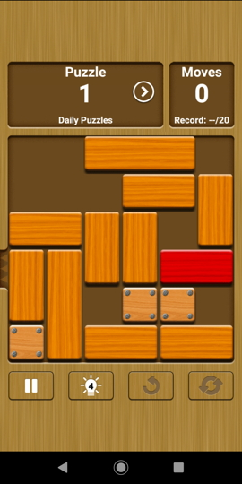

# UNBLOCK

This javascript program solves `unblock me` types of puzzle :

 

It does not try to optimize the search, and uses brute force
algorithm with backtracking.

## IN NODE.JS

The game must be described in a json file. Example `601.json` :
```
{
	"nrow":6,
	"ncol":6,
	"exit":"r",
	"pieces":[
		{"dir":"h","len":2,"row":2,"col":0},
		{"dir":"h","len":2,"row":0,"col":0},	
		{"dir":"v","len":2,"row":0,"col":3},
		{"dir":"h","len":2,"row":0,"col":4},
		{"dir":"h","len":3,"row":1,"col":0},
		{"dir":"v","len":3,"row":1,"col":5},
		{"dir":"v","len":2,"row":3,"col":0},
		{"dir":"h","len":2,"row":3,"col":1},
		{"dir":"h","len":2,"row":3,"col":3},
		{"dir":"v","len":2,"row":4,"col":2},
		{"dir":"h","len":3,"row":4,"col":3},		
		{"dir":"h","len":2,"row":5,"col":0}
	]
}
```

* `nrow` is the number of rows of the field

* `ncol` is the number of colums of the field

* `exit` is exit side : top (t) bottom (b) left (l) right (r)

* `pieces` is the array of pieces

	The first piece MUST BE the target (usually the red piece)

	`dir` specifies if the piece is horizontal (h) or vertical (v)

	`len` is the length of the piece (1,2 or 3)

	`row` and `col` specify the left-most or top-most position of the piece
	
	`fix` is set to true if the piece cannot move

## EXECUTION

Run
```
node unblock.js 601.json
```

If everything is OK, the solution is displayed one step after each other.
Example :

```
  1  1  .  2  3  3
  4  4  4  2  .  5
  0  0  .  .  .  5
  6  7  7  8  8  5
  6  .  9 10 10 10
 11 11  9  .  .  .
-------------------------
1 : piece 0 to right
  1  1  .  2  3  3
  4  4  4  2  .  5
  .  0  0  .  .  5
  6  7  7  8  8  5
  6  .  9 10 10 10
 11 11  9  .  .  .
-------------------------
2 : piece 2 to bottom
  1  1  .  .  3  3
  4  4  4  2  .  5
  .  0  0  2  .  5
  6  7  7  8  8  5
  6  .  9 10 10 10
 11 11  9  .  .  .
-------------------------
3 : piece 3 to left
  1  1  .  3  3  .
  4  4  4  2  .  5
  .  0  0  2  .  5
  6  7  7  8  8  5
  6  .  9 10 10 10
 11 11  9  .  .  .
-------------------------
4 : piece 5 to top
  1  1  .  3  3  5
  4  4  4  2  .  5
  .  0  0  2  .  5
  6  7  7  8  8  .
  6  .  9 10 10 10
 11 11  9  .  .  .
-------------------------
5 : piece 6 to top
  1  1  .  3  3  5
  4  4  4  2  .  5
  6  0  0  2  .  5
  6  7  7  8  8  .
  .  .  9 10 10 10
 11 11  9  .  .  .
-------------------------
6 : piece 8 to right
  1  1  .  3  3  5
  4  4  4  2  .  5
  6  0  0  2  .  5
  6  7  7  .  8  8
  .  .  9 10 10 10
 11 11  9  .  .  .
-------------------------
7 : piece 2 to bottom
  1  1  .  3  3  5
  4  4  4  .  .  5
  6  0  0  2  .  5
  6  7  7  2  8  8
  .  .  9 10 10 10
 11 11  9  .  .  .
-------------------------
8 : piece 4 to right
  1  1  .  3  3  5
  .  4  4  4  .  5
  6  0  0  2  .  5
  6  7  7  2  8  8
  .  .  9 10 10 10
 11 11  9  .  .  .
-------------------------
9 : piece 6 to top
  1  1  .  3  3  5
  6  4  4  4  .  5
  6  0  0  2  .  5
  .  7  7  2  8  8
  .  .  9 10 10 10
 11 11  9  .  .  .
-------------------------
10 : piece 7 to left
  1  1  .  3  3  5
  6  4  4  4  .  5
  6  0  0  2  .  5
  7  7  .  2  8  8
  .  .  9 10 10 10
 11 11  9  .  .  .
-------------------------
11 : piece 9 to top
  1  1  .  3  3  5
  6  4  4  4  .  5
  6  0  0  2  .  5
  7  7  9  2  8  8
  .  .  9 10 10 10
 11 11  .  .  .  .
-------------------------
12 : piece 11 to right
  1  1  .  3  3  5
  6  4  4  4  .  5
  6  0  0  2  .  5
  7  7  9  2  8  8
  .  .  9 10 10 10
  .  .  . 11 11  .
-------------------------
13 : piece 9 to bottom
  1  1  .  3  3  5
  6  4  4  4  .  5
  6  0  0  2  .  5
  7  7  .  2  8  8
  .  .  9 10 10 10
  .  .  9 11 11  .
-------------------------
14 : piece 7 to right
  1  1  .  3  3  5
  6  4  4  4  .  5
  6  0  0  2  .  5
  .  7  7  2  8  8
  .  .  9 10 10 10
  .  .  9 11 11  .
-------------------------
15 : piece 6 to bottom
  1  1  .  3  3  5
  .  4  4  4  .  5
  6  0  0  2  .  5
  6  7  7  2  8  8
  .  .  9 10 10 10
  .  .  9 11 11  .
-------------------------
16 : piece 4 to left
  1  1  .  3  3  5
  4  4  4  .  .  5
  6  0  0  2  .  5
  6  7  7  2  8  8
  .  .  9 10 10 10
  .  .  9 11 11  .
-------------------------
17 : piece 2 to top
  1  1  .  3  3  5
  4  4  4  2  .  5
  6  0  0  2  .  5
  6  7  7  .  8  8
  .  .  9 10 10 10
  .  .  9 11 11  .
-------------------------
18 : piece 6 to bottom
  1  1  .  3  3  5
  4  4  4  2  .  5
  .  0  0  2  .  5
  .  7  7  .  8  8
  6  .  9 10 10 10
  6  .  9 11 11  .
-------------------------
19 : piece 7 to left
  1  1  .  3  3  5
  4  4  4  2  .  5
  .  0  0  2  .  5
  7  7  .  .  8  8
  6  .  9 10 10 10
  6  .  9 11 11  .
-------------------------
20 : piece 8 to left
  1  1  .  3  3  5
  4  4  4  2  .  5
  .  0  0  2  .  5
  7  7  .  8  8  .
  6  .  9 10 10 10
  6  .  9 11 11  .
-------------------------
21 : piece 5 to bottom
  1  1  .  3  3  .
  4  4  4  2  .  5
  .  0  0  2  .  5
  7  7  .  8  8  5
  6  .  9 10 10 10
  6  .  9 11 11  .
-------------------------
22 : piece 3 to right
  1  1  .  .  3  3
  4  4  4  2  .  5
  .  0  0  2  .  5
  7  7  .  8  8  5
  6  .  9 10 10 10
  6  .  9 11 11  .
-------------------------
23 : piece 2 to top
  1  1  .  2  3  3
  4  4  4  2  .  5
  .  0  0  .  .  5
  7  7  .  8  8  5
  6  .  9 10 10 10
  6  .  9 11 11  .
-------------------------
24 : piece 0 to right
  1  1  .  2  3  3
  4  4  4  2  .  5
  .  .  .  0  0  5
  7  7  .  8  8  5
  6  .  9 10 10 10
  6  .  9 11 11  .
-------------------------
25 : piece 9 to top
  1  1  .  2  3  3
  4  4  4  2  .  5
  .  .  9  0  0  5
  7  7  9  8  8  5
  6  .  . 10 10 10
  6  .  . 11 11  .
-------------------------
26 : piece 10 to left
  1  1  .  2  3  3
  4  4  4  2  .  5
  .  .  9  0  0  5
  7  7  9  8  8  5
  6  . 10 10 10  .
  6  .  . 11 11  .
-------------------------
27 : piece 5 to bottom
  1  1  .  2  3  3
  4  4  4  2  .  .
  .  .  9  0  0  .
  7  7  9  8  8  5
  6  . 10 10 10  5
  6  .  . 11 11  5
-------------------------
28 : piece 0 to right
  1  1  .  2  3  3
  4  4  4  2  .  .
  .  .  9  .  0  0
  7  7  9  8  8  5
  6  . 10 10 10  5
  6  .  . 11 11  5
-------------------------
```

## IN THE BROWSER

In the browser several features are available :

* You can build the puzzle interactively.
Choose the size of the field, then use the mouse to position
the various pieces.

* You can export the puzzle just built in the previous step.

* You can import a json file by dropping it to the initial form.

* You can solve the puzzle with the `solve` button.

* Once the solution is computed, you can play it with the `play` button.

NOTE : Only safari will allow you to run from a local file.
Others browsers (Chrome, Firefox) cannot load web worker from
a local file. You will have to open the html file from a web
server.


